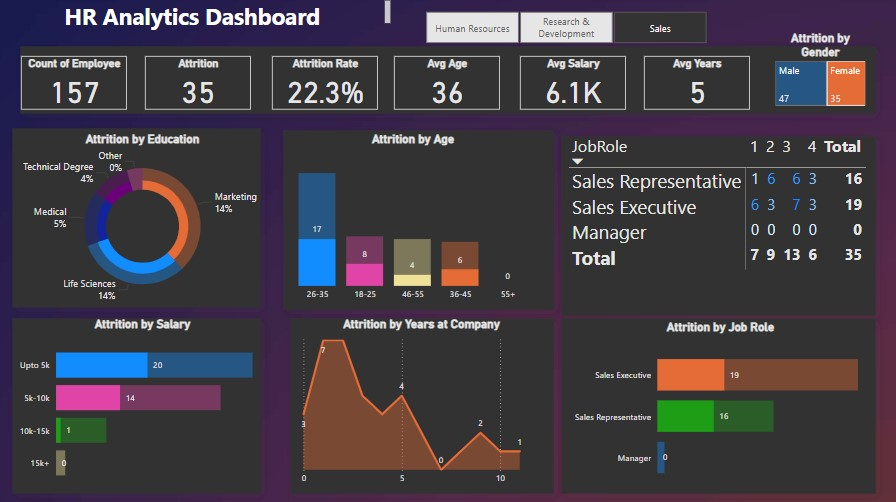

# HR Analysis

This project presents a dynamic HR analytics dashboard built in Power BI to explore and understand employee attrition patterns across different dimensions. The goal is to help HR professionals make data-driven decisions to reduce turnover and improve workforce stability.

## Problem Statement ##
High employee attrition poses a significant challenge for organizations, impacting productivity, morale, and recruitment costs. However, without a clear understanding of the underlying causes—such as job roles, salary levels, age groups, or education backgrounds—HR teams struggle to implement effective retention strategies.

This project aims to analyze employee data to identify key patterns and risk factors associated with attrition. By leveraging Power BI to create an interactive dashboard, the objective is to help HR professionals make informed, data-driven decisions that reduce turnover and improve workforce stability
## Project Overview

The dashboard provides a visual summary of key HR metrics such as attrition rate, average age, salary distribution, years of service, and more. It allows users to filter and explore trends based on gender, job role, education, salary brackets, and other important factors.

## Dataset Details

- File: HR_Analytics.csv
- Total Employees: 157
- Employees Who Left: 35
- Attrition Rate: 22.3%

## Key Metrics

| Metric             | Value      |
|--------------------|------------|
| Total Employees    | 157        |
| Attrition Count    | 35         |
| Attrition Rate     | 22.3%      |
| Average Age        | 36         |
| Average Salary      | 6.1K       |
| Average Tenure     | 5 years    |
| Male Attrition     | 47         |
| Female Attrition   | 35         |

## Insights & Observations

### 1. Education
- Employees with Marketing and Life Sciences backgrounds show the highest attrition (14% each).
- Medical graduates have the lowest attrition (5%).

### 2. Age Group
- The 26–35 age group sees the highest number of resignations (17).
- Attrition is lower in senior age groups (46+), indicating higher retention.

### 3. Salary Range
- Most attrition occurs among employees earning less than ₹5,000.
- Higher salaries correlate with significantly lower attrition.

### 4. Years at Company
- New employees (0–1 year) tend to leave more frequently.
- No attrition was recorded among those with 5–10 years of service.

### 5. Job Role
- Sales Executives: 19 employees left
- Sales Representatives: 16 employees left
- Managers: No attrition observed

### 6. Gender
- Male attrition is slightly higher than female attrition.
- The distribution indicates a fairly balanced gender trend in resignations.

## Visuals Included

- Donut Chart for Education-wise attrition
- Bar Charts for Salary, Gender, and Job Role attrition
- Line Graph showing Years at Company vs Attrition
- Matrix for Job Role and Employee Count

## How to Use This Dashboard

1. Open Power BI and import the `HR_Analytics.csv` file.
2. Use the fields provided to recreate the visualizations.
3. Apply filters to slice data by job role, age, gender, or salary to explore patterns.
4. Use the dashboard for reporting, presentations, or strategic planning.

## Tools Used

- Power BI for data visualization and dashboard creation
- Microsoft Excel for basic data cleaning and formatting
- CSV dataset for structured data input

## Conclusion

This HR Analytics Dashboard serves as a valuable tool for understanding employee attrition trends. By pinpointing the departments and groups most at risk, HR teams can focus their retention strategies more effectively.

It also highlights the importance of salary, early engagement, and age demographics in employee retention.

